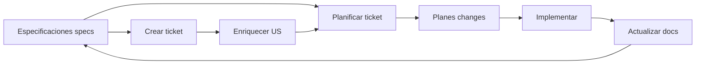

# ai-specs — Estructura base para Spec-Driven Development (SDD)

## Propósito general

Este proyecto tiene como **finalidad** mantener una **configuración base reutilizable** para equipos que desarrollan software con asistencia de IA: reglas, estándares, comandos y convenciones se centralizan aquí para que no dependan de un único editor o de un único proveedor de copilot.

Es **transversal** por diseño: la misma base puede adoptarse en **cualquier IDE o entorno asistido por IA** (por ejemplo Cursor, Visual Studio Code con extensiones de IA, Antigravity, Claude Code, GitHub Copilot, Gemini en el IDE, u otros que sigan convenciones similares de archivos de proyecto). Los puntos de entrada por herramienta (`AGENTS.md`, `CLAUDE.md`, `codex.md`, `GEMINI.md`, carpetas `.cursor/`, `.github/`, `.agent/`, etc.) actúan como **adaptadores** hacia un único núcleo de especificaciones en `./specs/`.

En la práctica sirve como **plantilla o repositorio de referencia** que puedes copiar, enlazar o versionar junto a tus aplicaciones para que humanos e IA compartan la misma fuente de verdad sobre cómo se especifica, planifica e implementa el software.

---

Este repositorio es una **estructura base** para aplicar **Spec-Driven Development (SDD)**: desarrollo guiado por especificaciones y estándares. Las especificaciones viven en `./specs/` y son la fuente de verdad; los comandos y agentes de IA planifican e implementan siguiendo esas especificaciones.

El núcleo normativo incluye, además de [base-standards.mdc](./specs/base-standards.mdc), el **flujo SDD operativo** ([flujo-desarrollo-standards.md](./specs/flujo-desarrollo-standards.md): fases, gates, ramas y anti-patrones) y los **requisitos y gates del PRD** ([prd-requirements-standards.md](./specs/prd-requirements-standards.md)).

Se recomienda usarlo junto con frameworks de Spec-Driven Development como [OpenSpec](https://github.com/Fission-AI/OpenSpec).

## Estructura del repositorio

| Ubicación | Descripción |
|-----------|-------------|
| **Raíz** | README, `codex.md`, `AGENTS.md`, `CLAUDE.md`, `GEMINI.md`: referencias a las reglas de desarrollo para cada herramienta (Codex, Cursor, Claude, Gemini). |
| **.cursor/** | Reglas para Cursor en `rules/` (`use-base-rules.mdc`, `sdd-skills-map.mdc`, `redmine-default-project.mdc`); comandos opcionales en `commands/*.md`. |
| **.claude/** | Agentes y comandos para Claude: `agents/*.md`, `commands/*.md`. |
| **.vscode/** | Configuración del editor (`settings.json`) y, si aplica, `mcp.json` para integración MCP (p. ej. Redmine). |
| **.github/** | Configuración para VS Code con Copilot (p. ej. `.instructions.md`, referencias a reglas de desarrollo). |
| **docs/** | Guías narrativas del flujo SDD, plantillas (ADR, UX Flow) e informes; ver [guia-sdd.md](../docs/guia-sdd.md). |
| **ai-specs/** | Núcleo SDD (esta carpeta): agentes por rol, comandos reutilizables, especificaciones y planes de cambio. |
| **.agents/skills/** | Skills de agente versionados en el repo (contenido copiado o enlazado según el equipo). |
| **skills-lock.json** | Inventario y huellas de los skills del proyecto en la raíz del repositorio. |
| **evidence/** | Evidencia de cumplimiento (checklist IDOR: reportes, diagramas, pruebas de seguridad, monitoreo). |

Dentro de **ai-specs/** (relativo a la raíz del repo; este documento está en esa carpeta):

- **./.agents/** — Definiciones de agentes por rol (p. ej. `backend-developer`, `frontend-developer`) para que las IA adopten roles y sigan estándares. No confundir con **skills** del proyecto en `../.agents/skills/` (ver más abajo).
- **./.commands/** — Comandos reutilizables: `create-us`, `enrich-us`, `plan-backend-ticket`, `plan-frontend-ticket`, `develop-backend`, `develop-frontend`, `update-docs`, `meta-prompt`, `meta-prompt-design-base`. Los comandos en `.cursor/commands/` y `.claude/commands/` pueden referenciar estos para mantener una única definición.
- **./specs/** — Especificaciones y estándares. La **fuente única de verdad** para reglas de desarrollo es [base-standards.mdc](./specs/base-standards.mdc). Incluye backend, frontend, diseño base, documentación, flujo SDD, requisitos PRD, seguridad y despliegue, además de `api-spec.yml`, `data-model.md`, `development-guide.md` e infraestructura.
- **./changes/** — Planes de implementación por ticket (p. ej. `SCRUM-10_backend.md`), generados por los comandos de planificación.

### Skills versionados (raíz del repo)

- **[skills-lock.json](../skills-lock.json)** — Lista e integridad de los skills incluidos en el proyecto; conviene mantenerlo alineado cuando se añadan o cambien skills.
- **`../.agents/skills/`** — Contenido de cada skill (p. ej. `SKILL.md` y referencias). Los agentes deben seguir el **mapa fase SDD → skill** y las advertencias de brecha descritas en [sdd-skills-map.mdc](../.cursor/rules/sdd-skills-map.mdc) (p. ej. testing backend Java frente a E2E; seguridad IDOR frente a skills genéricos de API). El cumplimiento normativo sigue siendo [security-standards.md](./specs/security-standards.md) y [base-standards.mdc](./specs/base-standards.mdc).

Árbol de directorios de referencia:

```
.
├── .agents/
│   └── skills/                  # Skills de agente (versionados; ver skills-lock.json)
├── docs/                        # Guía SDD, plantillas, informes
├── ai-specs/
│   ├── specs/                   # Estándares y especificaciones
│   │   ├── base-standards.mdc   # Reglas de desarrollo (fuente única de verdad)
│   │   ├── backend-standards.mdc
│   │   ├── frontend-standards.mdc
│   │   ├── design-base.mdc      # Base de diseño / estilo (ERP)
│   │   ├── documentation-standards.mdc
│   │   ├── flujo-desarrollo-standards.md  # Fases 0–8, gates, ramas
│   │   ├── prd-requirements-standards.md  # Gates PRD y artefactos
│   │   ├── api-spec.yml         # Especificación OpenAPI
│   │   ├── data-model.md
│   │   ├── development-guide.md
│   │   ├── security-standards.md
│   │   └── deploy-standards.md
│   ├── .commands/               # Comandos reutilizables (create-us, plan, develop, enrich, etc.)
│   ├── .agents/                 # Definiciones de agentes por rol (backend, frontend, etc.)
│   └── changes/                 # Planes de implementación por feature
│       └── SCRUM-10_backend.md # Ejemplo: plan de actualización de posición
├── evidence/                    # Evidencia de cumplimiento (checklist IDOR y otros)
├── skills-lock.json             # Inventario de skills del proyecto
├── AGENTS.md                    # Configuración genérica de agentes
├── CLAUDE.md                    # Configuración para Claude/Cursor
├── codex.md                     # Configuración para GitHub Copilot/Codex
└── GEMINI.md                    # Configuración para Google Gemini
```

### Reglas (.mdc) y documentación (.md) en Cursor

Si usas **Cursor**, conviene distinguir:

- **Normativa en `./specs/`:** archivos `.mdc` (reglas de dominio: backend, frontend, documentación, diseño base) y `.md` de referencia (flujo SDD, PRD, seguridad, despliegue, datos, etc.). La fuente transversal sigue siendo [base-standards.mdc](./specs/base-standards.mdc).
- **Reglas operativas del IDE en `../.cursor/rules/`:** complementan sin sustituir a `base-standards.mdc`:
  - [use-base-rules.mdc](../.cursor/rules/use-base-rules.mdc) — apunta a `./specs/base-standards.mdc` y a reglas complementarias.
  - [sdd-skills-map.mdc](../.cursor/rules/sdd-skills-map.mdc) — mapa SDD → skills y advertencias de brecha.
  - [redmine-default-project.mdc](../.cursor/rules/redmine-default-project.mdc) — contexto por defecto de proyecto/tickets Redmine.
- **Archivos `.mdc` en `./specs/`:** Cursor puede cargarlos como reglas del proyecto (frontmatter con `description`, opcionalmente `globs` y `alwaysApply`). Al añadir reglas nuevas que deban aplicarse en Cursor, enlázalas desde [base-standards.mdc](./specs/base-standards.mdc) o desde `../.cursor/rules/`.
- **Archivos `.md` (documentación):** referencia que no sustituye a las reglas: `data-model.md`, `development-guide.md`, `security-standards.md`, `deploy-standards.md`, etc.
- **Resumen:** reglas de dominio = `./specs/*.mdc` y reglas del IDE = `../.cursor/rules/*.mdc`; documentación de dominio y guías = `.md` en `./specs/` y en `../docs/`.

### Comparativa de formatos por IDE

| IDE              | Formato de reglas            | Ubicación                                       |
| ---------------- | ---------------------------- | ----------------------------------------------- |
| Cursor           | .mdc con frontmatter         | .cursor/rules/*.mdc                             |
| VSCode + Copilot | .instructions.md / AGENTS.md | .github/ o raíz del proyecto code.visualstudio​ |
| Windsurf         | .md con frontmatter propio   | .windsurf/rules/*.md                    |
| Antigravity      | .md (Rules/Workflows/Skills) | .agent/rules/                          |

## Soporte multi-copilot

El repositorio usa **enlaces simbólicos** o **convenciones de nombre** para soportar varios copilots de IA sin duplicar reglas:

- **`AGENTS.md`** — Reglas genéricas (compatible con la mayoría de copilots).
- **`CLAUDE.md`** — Orientado a Claude/Cursor.
- **`codex.md`** — Orientado a GitHub Copilot/Codex.
- **`GEMINI.md`** — Orientado a Google Gemini.

Todos estos archivos referencian las mismas reglas en `./specs/base-standards.mdc`, de modo que cada herramienta carga su archivo preferido pero aplica el mismo núcleo de reglas.

Ventajas de este enfoque:

- **Una sola fuente de verdad**: las reglas se mantienen en `base-standards.mdc`.
- **Compatibilidad**: cada copilot encuentra su configuración por nombre.
- **Sin configuración extra**: al importar el repo en un proyecto, las reglas se cargan automáticamente.
- **Actualizaciones centralizadas**: un cambio en las reglas beneficia a todos los copilots.
- **Portable**: la estructura se puede copiar a cualquier proyecto.

## Cómo empezar

1. **Importar en tu proyecto**: clona o copia este repositorio (o al menos la carpeta `ai-specs/` y, si usas Cursor o Claude, `.cursor/` y `.claude/`).
2. **Comprobar la configuración**: tu copilot cargará automáticamente:
   - **Claude/Cursor**: `CLAUDE.md` → `./specs/base-standards.mdc`
   - **GitHub Copilot**: `codex.md` → `./specs/base-standards.mdc`
   - **Gemini**: `GEMINI.md` → `./specs/base-standards.mdc`

No hace falta ajustar rutas manualmente; están pensadas para funcionar tal cual.

## Flujo de trabajo SDD

Para el **ciclo completo** (fases 0–8, gates de calidad, convenciones de ramas y comandos), la referencia normativa es [flujo-desarrollo-standards.md](./specs/flujo-desarrollo-standards.md). Una guía narrativa paso a paso está en [guia-sdd.md](../docs/guia-sdd.md).



El diagrama resume el ciclo; el detalle de fases, gates y artefactos obligatorios está en [flujo-desarrollo-standards.md](./specs/flujo-desarrollo-standards.md) y los requisitos del PRD en [prd-requirements-standards.md](./specs/prd-requirements-standards.md).

1. **Especificaciones** — Estándares, API, modelo de datos y guías en `./specs/`.
2. **Creación de ticket** — Comando `create-us` cuando haya que registrar en Redmine una historia o tarea con la estructura acordada (suele ir antes de enriquecer o planificar).
3. **Enriquecimiento de historias de usuario** — Comando `enrich-us` para detallar tickets según buenas prácticas.
4. **Planificación por ticket** — Comandos `plan-backend-ticket` y `plan-frontend-ticket` generan planes en `./changes/`.
5. **Implementación** — Comandos `develop-backend` y `develop-frontend` guían el desarrollo siguiendo los planes y estándares.
6. **Documentación** — Comando `update-docs` para mantener la documentación alineada con [documentation-standards.mdc](./specs/documentation-standards.mdc).

### Uso por comandos

Flujo recomendado con comandos concretos (alineado con [guia-sdd.md](../docs/guia-sdd.md)):

**Paso 0: Crear ticket en Redmine (cuando aplique)**  
Para crear un ticket con la estructura obligatoria:

```
/create-us
```

(o el identificador que use tu entorno para el comando definido en [create-us.md](./.commands/create-us.md)).

**Paso 1: Enriquecer la historia de usuario (opcional)**  
Si la historia de usuario tiene poca detalle o criterios de aceptación, usa el comando **`enrich-us`**:

```
/enrich-us SCRUM-10
```

La IA generará criterios de aceptación detallados, casos límite, consideraciones técnicas y escenarios de prueba. Puedes omitir este paso si la historia ya está suficientemente detallada.

**Paso 2: Planificar el feature**  
Genera un plan de implementación con:

```
plan-backend-ticket SCRUM-10
```

o, para frontend:

```
plan-frontend-ticket SCRUM-15
```

Se crea un plan paso a paso en `./changes/`.

**Paso 3: Implementar siguiendo el plan**  
Indica el plan generado y ejecuta:

```
develop-backend @SCRUM-10_backend.md
```

o

```
develop-frontend @SCRUM-15_frontend.md
```

La IA seguirá el plan aplicando TDD, pruebas y actualización de documentación.

**Meta-prompts y diseño** — Para flujos de meta-prompt o diseño base, consulta [meta-prompt.md](./.commands/meta-prompt.md) y [meta-prompt-design-base.md](./.commands/meta-prompt-design-base.md).

**Ejemplo completo (SCRUM-10 — actualización de posición)**  
- **Tú dices:** `/create-us` (si el ticket aún no existe en Redmine) → ticket creado con estructura acordada.  
- **Tú dices:** `/enrich-us SCRUM-10` → La IA enriquece la historia (omitir si ya está detallada).  
- **Tú dices:** `/plan-backend-ticket SCRUM-10` → La IA genera `./changes/SCRUM-10_backend.md` con contexto de arquitectura, pasos de implementación, especificaciones de tests y reglas de validación.  
- **Tú dices:** `/develop-backend @SCRUM-10_backend.md` → La IA crea la rama, implementa validación, servicio, controlador, rutas, tests (cobertura alta) y actualiza la documentación de la API.

Puedes ver ejemplos reales en el repositorio:

- **Historia de usuario enriquecida**: [SCRUM-10-Position-Update.md](./changes/SCRUM-10-Position-Update.md) — criterios de aceptación, especificación técnica, documentación del endpoint, reglas de validación, requisitos de seguridad y pruebas.
- **Plan de implementación**: [SCRUM-10_backend.md](./changes/SCRUM-10_backend.md) — contexto de arquitectura, instrucciones paso a paso, ejemplos de código y especificaciones de tests.

## Principios y estándares

Todo el desarrollo sigue los principios definidos en [base-standards.mdc](./specs/base-standards.mdc):

### Principios clave

1. **Tareas pequeñas, una a la vez**: pasos muy pequeños, sin saltar etapas.
2. **Test-Driven Development (TDD)**: escribir primero los tests que fallen.
3. **Type safety**: código totalmente tipado.
4. **Nombres claros**: variables y funciones descriptivas.
5. **Idioma**: código y artefactos técnicos (API, esquemas, nombres de BD, comentarios en código) en **inglés**; documentación, reglas y mensajes al usuario en **español**.
6. **Cobertura de tests**: cobertura alta en todas las capas.
7. **Cambios incrementales**: modificaciones acotadas y fáciles de revisar.

### Estándares específicos

- **Flujo SDD operativo**: [flujo-desarrollo-standards.md](./specs/flujo-desarrollo-standards.md) — fases 0–8, gates, ramas y comandos.
- **Requisitos y gates PRD**: [prd-requirements-standards.md](./specs/prd-requirements-standards.md).
- **Backend**: [backend-standards.mdc](./specs/backend-standards.mdc) — patrones de API, base de datos, seguridad y pruebas.
- **Frontend**: [frontend-standards.mdc](./specs/frontend-standards.mdc) — componentes React, UI/UX, estado y pruebas de componentes.
- **Diseño base**: [design-base.mdc](./specs/design-base.mdc) — base de diseño y estilo aplicable al producto.
- **Documentación**: [documentation-standards.mdc](./specs/documentation-standards.mdc) — estructura de documentación técnica, OpenAPI y mantenimiento.
- **Seguridad**: [security-standards.md](./specs/security-standards.md) — IDOR, SSO, gateway y evidencia en `evidence/`.
- **Despliegue**: [deploy-standards.md](./specs/deploy-standards.md).

## Uso de esta base

Para usar este repo como **plantilla** en un nuevo proyecto:

1. Clonar o copiar el repositorio (o al menos la carpeta `ai-specs/` y, si aplica, `.cursor/` y `.claude/`).
2. Ajustar el contenido de `./specs/` al dominio del proyecto: API, modelo de datos, estándares concretos de backend/frontend e infra.
3. Mantener `base-standards.mdc` y los comandos/agentes como referencia para que las IA sigan el mismo flujo SDD.

### Adaptación al proyecto

- **Contexto técnico**: en `./specs/` modifica estándares de backend/frontend/documentación, guía de instalación, modelo de datos y API según tu proyecto.
- **Agentes**: adapta las definiciones en `./.agents/` a los roles y flujos de tu equipo; los **skills** en `../.agents/skills/` y [skills-lock.json](../skills-lock.json) según la política del equipo.
- **Comandos**: añade o ajusta comandos en `./.commands/` y mantén los enlaces o referencias desde `.cursor/commands/` y `.claude/commands/`.
- **Recursos**: enlaza documentación o tareas propias del proyecto (p. ej. con MCPs en `.vscode/mcp.json` o `.cursor/mcp.json`) cuando sea necesario.
- **Seguridad MCP**: no versionar secretos reales en `mcp.json`; usar placeholders o variables de entorno para `X-API-Key`.

### Mantenimiento de estándares

- Actualizar siempre primero `base-standards.mdc` (fuente única de verdad).
- Versionar los cambios en estándares como si fueran código.
- Revisar cambios en estándares en equipo (por ejemplo mediante pull requests).
- Mantener los ejemplos en `changes/` alineados con la implementación real.

## Beneficios

- **Calidad consistente**: la IA aplica siempre los mismos estándares.
- **Tests y documentación**: cobertura de pruebas y documentación de API actualizada con el flujo.
- **Onboarding más rápido**: nuevas personas pueden apoyarse en las mismas reglas.
- **Varios copilots**: cada miembro puede usar su herramienta preferida (Cursor, Claude, Copilot, Gemini) con las mismas reglas.
- **Menor deuda técnica**: buenas prácticas aplicadas desde el inicio.

## Referencias

- **Reglas de desarrollo**: [base-standards.mdc](./specs/base-standards.mdc)
- **Guía SDD (narrativa)**: [guia-sdd.md](../docs/guia-sdd.md)
- **Checklist de auditoría estructural SDD**: [sdd-structure-checklist.md](../docs/sdd-structure-checklist.md)
- **Plantillas**: [ADR-template.md](../docs/templates/ADR-template.md), [UX-Flow-template.md](../docs/templates/UX-Flow-template.md)
- **Informe skills / SDD** (si aplica al equipo): [sdd-skills-analysis-report.md](../docs/sdd-skills-analysis-report.md)
- **Guía de desarrollo y entorno**: [development-guide.md](./specs/development-guide.md)
- **OpenSpec**: framework de Spec-Driven Development — [OpenSpec en GitHub](https://github.com/Fission-AI/OpenSpec)

### Ejemplos de referencia

Los siguientes archivos sirven como **ejemplos de referencia**. Debes crear versiones propias adaptadas a tu proyecto:

- **Especificación de API**: [api-spec.yml](./specs/api-spec.yml) (OpenAPI 3.0) — documenta los endpoints de tu API.
- **Modelo de datos**: [data-model.md](./specs/data-model.md) — esquemas de base de datos y entidades de dominio.
- **Guía de desarrollo**: [development-guide.md](./specs/development-guide.md) — instalación y flujos de trabajo según tu stack.

## Contribución

Al contribuir a los estándares:

1. Actualizar `base-standards.mdc` en primer lugar (fuente única de verdad).
2. Actualizar la documentación afectada siguiendo el proceso en [documentation-standards.mdc](./specs/documentation-standards.mdc) (revisar cambios, actualizar narrativa en español, reportar archivos modificados).
3. Probar con varios copilots para asegurar compatibilidad.
4. Actualizar los ejemplos en la carpeta `changes/` si aplica.
5. Si cambias skills del proyecto, mantener alineado [skills-lock.json](../skills-lock.json) y el contenido en `../.agents/skills/` según el procedimiento del equipo.
6. Documentar con claridad los cambios que rompan compatibilidad.
7. Seguir en tu contribución los mismos estándares que defines.
