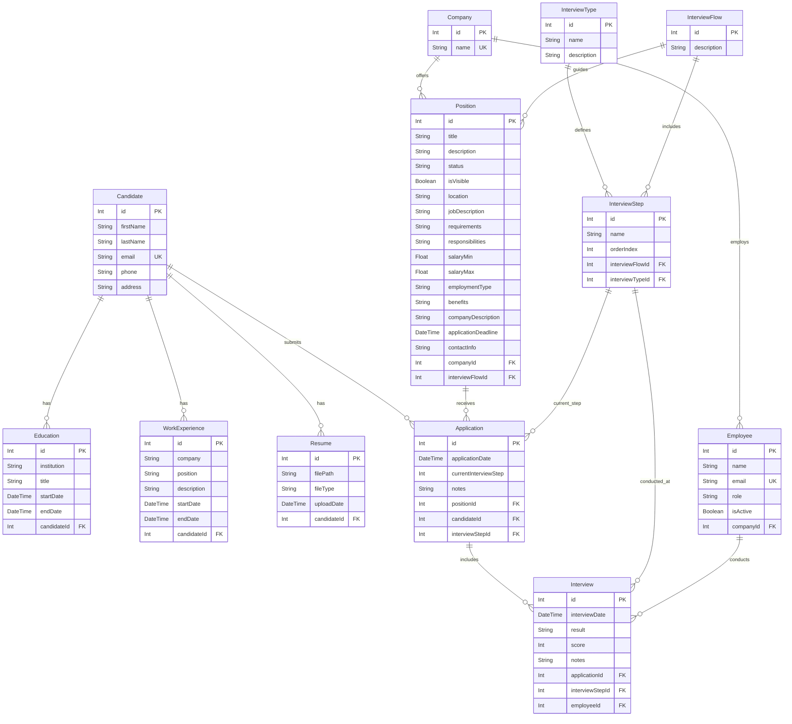

# Documentación del modelo de datos

Este documento describe el modelo de datos de la aplicación: descripciones de entidades, definiciones de campos, relaciones y diagrama entidad-relación.

## Descripción de modelos

### 1. Candidate
Representa un candidato a un puesto que puede aplicar a posiciones dentro del sistema.

**Campos:**
- `id`: Identificador único del candidato (Primary Key)
- `firstName`: Nombre del candidato (máx. 100 caracteres)
- `lastName`: Apellido del candidato (máx. 100 caracteres)
- `email`: Email único del candidato (máx. 255 caracteres)
- `phone`: Teléfono del candidato (opcional, máx. 15 caracteres)
- `address`: Dirección del candidato (opcional, máx. 100 caracteres)

**Reglas de validación:**
- Nombre y apellido obligatorios, 2-100 caracteres, solo letras
- Email obligatorio, único y formato válido
- Teléfono opcional; si se indica, formato español (6|7|9)XXXXXXXX
- Dirección opcional, no puede superar 100 caracteres
- Máximo 3 registros de educación por candidato

**Relaciones:**
- `educations`: Relación uno-a-muchos con el modelo Education
- `workExperiences`: Relación uno-a-muchos con el modelo WorkExperience
- `resumes`: Relación uno-a-muchos con el modelo Resume
- `applications`: Relación uno-a-muchos con el modelo Application

### 2. Education
Representa la formación académica de los candidatos.

**Campos:**
- `id`: Identificador único del registro de educación (Primary Key)
- `institution`: Nombre de la institución educativa (máx. 100 caracteres)
- `title`: Título o certificación obtenida (máx. 250 caracteres)
- `startDate`: Fecha de inicio del período formativo
- `endDate`: Fecha de fin (opcional, null si está en curso)
- `candidateId`: Foreign key que referencia Candidate

**Reglas de validación:**
- Institución obligatoria, máx. 100 caracteres
- Título obligatorio, máx. 250 caracteres
- Fecha de inicio obligatoria y formato de fecha válido
- Fecha de fin opcional; si se indica, debe ser válida
- Máximo 3 registros de educación por candidato

**Relaciones:**
- `candidate`: Relación muchos-a-uno con el modelo Candidate

### 3. WorkExperience
Representa el historial laboral y la experiencia profesional de los candidatos.

**Campos:**
- `id`: Identificador único del registro de experiencia (Primary Key)
- `company`: Nombre de la empresa u organización (máx. 100 caracteres)
- `position`: Puesto o cargo desempeñado (máx. 100 caracteres)
- `description`: Descripción de responsabilidades y logros (opcional, máx. 200 caracteres)
- `startDate`: Fecha de inicio de la experiencia
- `endDate`: Fecha de fin (opcional, null si es el puesto actual)
- `candidateId`: Foreign key que referencia Candidate

**Reglas de validación:**
- Nombre de empresa obligatorio, máx. 100 caracteres
- Puesto obligatorio, máx. 100 caracteres
- Descripción opcional, máx. 200 caracteres si se indica
- Fecha de inicio obligatoria y formato válido
- Fecha de fin opcional; si se indica, debe ser válida

**Relaciones:**
- `candidate`: Relación muchos-a-uno con el modelo Candidate

### 4. Resume
Representa los archivos de currículum asociados a los candidatos.

**Campos:**
- `id`: Identificador único del registro de currículum (Primary Key)
- `filePath`: Ruta en el sistema de archivos del currículum (máx. 500 caracteres)
- `fileType`: Tipo MIME o extensión del archivo (máx. 50 caracteres)
- `uploadDate`: Fecha y hora de subida del archivo
- `candidateId`: Foreign key que referencia Candidate

**Reglas de validación:**
- Ruta de archivo obligatoria, máx. 500 caracteres
- Tipo de archivo obligatorio, máx. 50 caracteres
- Fecha de subida asignada automáticamente
- Tipos soportados: PDF y DOCX (máx. 10MB)

**Relaciones:**
- `candidate`: Relación muchos-a-uno con el modelo Candidate

### 5. Company
Representa las empresas que publican posiciones y emplean personal.

**Campos:**
- `id`: Identificador único de la empresa (Primary Key)
- `name`: Nombre único de la empresa

**Relaciones:**
- `employees`: Relación uno-a-muchos con el modelo Employee
- `positions`: Relación uno-a-muchos con el modelo Position

### 6. Employee
Representa empleados de las empresas que pueden realizar entrevistas.

**Campos:**
- `id`: Identificador único del empleado (Primary Key)
- `name`: Nombre completo del empleado
- `email`: Email único del empleado
- `role`: Rol o puesto del empleado
- `isActive`: Boolean que indica si el empleado está activo
- `companyId`: Foreign key que referencia Company

**Relaciones:**
- `company`: Relación muchos-a-uno con el modelo Company
- `interviews`: Relación uno-a-muchos con el modelo Interview

### 7. InterviewType
Define los tipos de entrevista que se pueden realizar.

**Campos:**
- `id`: Identificador único del tipo de entrevista (Primary Key)
- `name`: Nombre del tipo (p. ej. "Technical", "HR", "Behavioral")
- `description`: Descripción detallada del tipo (opcional)

**Relaciones:**
- `interviewSteps`: Relación uno-a-muchos con el modelo InterviewStep

### 8. InterviewFlow
Representa una secuencia de pasos de entrevista que define el proceso de contratación.

**Campos:**
- `id`: Identificador único del flujo de entrevista (Primary Key)
- `description`: Descripción del proceso del flujo (opcional)

**Relaciones:**
- `interviewSteps`: Relación uno-a-muchos con el modelo InterviewStep
- `positions`: Relación uno-a-muchos con el modelo Position

### 9. InterviewStep
Representa cada paso dentro de un flujo de entrevista.

**Campos:**
- `id`: Identificador único del paso (Primary Key)
- `name`: Nombre del paso
- `orderIndex`: Orden numérico del paso dentro del flujo
- `interviewFlowId`: Foreign key que referencia InterviewFlow
- `interviewTypeId`: Foreign key que referencia InterviewType

**Relaciones:**
- `interviewFlow`: Relación muchos-a-uno con el modelo InterviewFlow
- `interviewType`: Relación muchos-a-uno con el modelo InterviewType
- `applications`: Relación uno-a-muchos con el modelo Application
- `interviews`: Relación uno-a-muchos con el modelo Interview

### 10. Position
Representa las posiciones de trabajo disponibles para aplicar.

**Campos:**
- `id`: Identificador único de la posición (Primary Key)
- `companyId`: Foreign key que referencia Company (obligatorio)
- `interviewFlowId`: Foreign key que referencia InterviewFlow (obligatorio)
- `title`: Título del puesto (obligatorio, máx. 100 caracteres)
- `description`: Descripción breve de la posición (obligatorio)
- `status`: Estado actual (default: Borrador; valores: Open, Contratado, Cerrado, Borrador)
- `isVisible`: Boolean que indica si la posición es visible públicamente (default: false)
- `location`: Ubicación del puesto (obligatorio)
- `jobDescription`: Descripción detallada del puesto (obligatorio)
- `requirements`: Requisitos y cualificaciones (opcional)
- `responsibilities`: Responsabilidades del puesto (opcional)
- `salaryMin`: Rango salarial mínimo (opcional, >= 0)
- `salaryMax`: Rango salarial máximo (opcional, >= 0 y >= salaryMin)
- `employmentType`: Tipo de empleo (p. ej. "Full-time", "Part-time", "Contract") (opcional)
- `benefits`: Descripción de beneficios (opcional)
- `companyDescription`: Descripción de la empresa (opcional)
- `applicationDeadline`: Fecha límite de aplicaciones (opcional, debe ser futura)
- `contactInfo`: Información de contacto (opcional)

**Reglas de validación:**
- Título obligatorio, máx. 100 caracteres
- Description, location y jobDescription son obligatorios
- Status debe ser uno de: Open, Contratado, Cerrado, Borrador
- Las referencias a Company e InterviewFlow deben existir en la base de datos
- Los valores salariales deben ser no negativos
- Si se indica application deadline, debe ser una fecha futura

**Relaciones:**
- `company`: Relación muchos-a-uno con el modelo Company
- `interviewFlow`: Relación muchos-a-uno con el modelo InterviewFlow
- `applications`: Relación uno-a-muchos con el modelo Application

### 11. Application
Representa la aplicación de un candidato a una posición concreta.

**Campos:**
- `id`: Identificador único de la aplicación (Primary Key)
- `applicationDate`: Fecha de envío de la aplicación
- `currentInterviewStep`: Paso actual en el proceso de entrevista
- `notes`: Notas adicionales sobre la aplicación (opcional)
- `positionId`: Foreign key que referencia Position
- `candidateId`: Foreign key que referencia Candidate
- `interviewStepId`: Foreign key que referencia el InterviewStep actual

**Relaciones:**
- `position`: Relación muchos-a-uno con el modelo Position
- `candidate`: Relación muchos-a-uno con el modelo Candidate
- `interviewStep`: Relación muchos-a-uno con el modelo InterviewStep
- `interviews`: Relación uno-a-muchos con el modelo Interview

### 12. Interview
Representa cada sesión de entrevista realizada como parte de una aplicación.

**Campos:**
- `id`: Identificador único de la entrevista (Primary Key)
- `interviewDate`: Fecha y hora de la entrevista
- `result`: Resultado o conclusión (opcional)
- `score`: Puntuación o valoración numérica (opcional)
- `notes`: Notas y feedback de la entrevista (opcional)
- `applicationId`: Foreign key que referencia Application
- `interviewStepId`: Foreign key que referencia InterviewStep
- `employeeId`: Foreign key que referencia el Employee que la realiza

**Relaciones:**
- `application`: Relación muchos-a-uno con el modelo Application
- `interviewStep`: Relación muchos-a-uno con el modelo InterviewStep
- `employee`: Relación muchos-a-uno con el modelo Employee

## Entity Relationship Diagram

## Principios de diseño

1. **Referential Integrity**: Las relaciones por foreign key garantizan la consistencia de datos en el sistema.

2. **Flexibility**: El sistema de flujos de entrevista permite procesos de contratación personalizables por posición.

3. **Audit Trail**: Las fechas de aplicación y entrevista proporcionan una línea temporal completa del proceso de contratación.

4. **Extensibility**: El diseño modular permite añadir con facilidad nuevas funcionalidades y datos.

5. **Data Normalization**: El modelo sigue principios de normalización de base de datos para minimizar redundancia y garantizar integridad.

## Notas

- Todos los campos `id` actúan como primary keys con auto-incremento
- Las relaciones por foreign key mantienen la integridad referencial
- Los campos opcionales permiten entrada flexible manteniendo la información núcleo obligatoria
- El sistema de entrevistas soporta procesos de contratación multi-paso con distintos tipos de entrevista
- Los campos de email tienen restricción única para evitar cuentas duplicadas