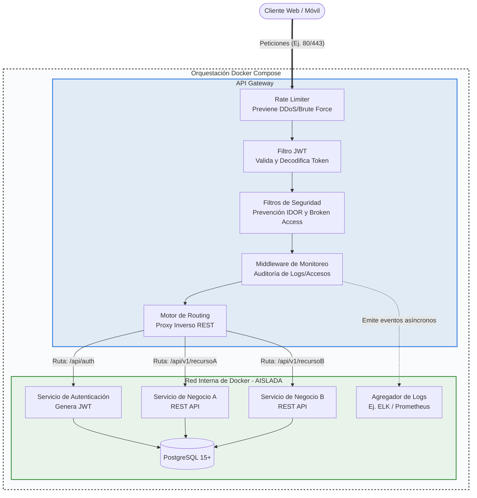

## Especificación de despliegue de sistemas

### 1) Objetivo
Definir la arquitectura, reglas operativas y procedimiento estándar para desplegar y evolucionar un entorno basado en microservicios con:

- Java 21 + Maven (JDK: distribución OpenJDK, p. ej. Eclipse Temurin; no Oracle JDK).
- Servicios Spring.
- PostgreSQL 15 o superior.
- Un único punto de entrada API Gateway con Spring Security.

Esta especificación aplica a ambientes de desarrollo (pruebas) y producción.

---

### 2) Alcance y principios

#### 2.1 Alcance
- Exposición HTTP/HTTPS solo por API Gateway.
- Servicios internos sin exposición pública.
- Base de datos aislada por red privada Docker.
- Observabilidad, trazabilidad y operación estandarizada.

#### 2.2 Principios técnicos
- **Gateway-first:** ningún microservicio publica puertos a Internet.
- **Zero Trust interno:** validación de identidad en el gateway y controles por servicio.
- **Least privilege:** usuarios y permisos mínimos para BD y red.
- **Immutable deploys:** configuración declarativa por `docker-compose` y variables de entorno.
- **Parity DEV/PROD:** mismo stack, diferencias controladas por perfiles y secretos.

#### 2.3 Compatibilidad tecnológica

Para cumplir el requerimiento de Java 21 de forma segura y mantenible, se define como estándar mínimo recomendado:
- El JDK debe ser una distribución OpenJDK (recomendado Eclipse Temurin); no se debe usar Oracle JDK por licenciamiento y paridad entre entornos.
- Spring Boot 3.5+ (Spring Framework 6+).
- Spring Security 6+.

---

### 3) Arquitectura base del entorno



---

### 4) Funcionamiento detallado del entorno

#### 4.1 Flujo de petición
1. Cliente consume endpoint público del gateway.
2. Gateway aplica rate limiting por IP/usuario/ruta.
3. Gateway valida JWT (firma, expiración, issuer, audience).
4. Gateway aplica políticas de seguridad (roles/scopes/claims).
5. Gateway registra evento de acceso y correlación (`traceId`, `spanId`).
6. Gateway enruta a servicio interno por path.
7. Servicio ejecuta lógica de negocio y accede a PostgreSQL.
8. Respuesta retorna por gateway con headers de seguridad.

#### 4.2 Seguridad centralizada
- El gateway es el único componente con autenticación/autorización centralizada vía Spring Security.
- Los servicios internos confían en headers firmados o contexto propagado por el gateway.
- Se bloquea acceso directo a servicios internos mediante red privada y ausencia de puertos públicos.
- Se fuerza TLS en producción desde borde (Nginx o LB) hacia gateway.

#### 4.3 Observabilidad
- Logging estructurado JSON en gateway y servicios.
- Trazabilidad distribuida con `traceId` obligatorio.
- Métricas de salud (`/actuator/health`) y readiness/liveness.
- Alarmas mínimas: error rate, latencia p95, reinicios de contenedor, consumo de CPU/RAM.

---

### 5) Estándar de ambientes

#### 5.1 Desarrollo / Pruebas
- Uso de `docker compose` local con perfiles `dev`.
- Hot reload opcional solo en servicios de desarrollo.
- Datos sintéticos o anonimizados.
- Secretos en `.env.dev` fuera de versionado.
- Se permite menor réplica, pero mismas rutas y contratos de API que producción.

#### 5.2 Producción
- Imagenes versionadas e inmutables (tag semántico o SHA).
- Mínimo 2 réplicas para gateway cuando aplique alta disponibilidad.
- Secretos gestionados por vault/gestor seguro (no en repositorio).
- TLS obligatorio, CORS restrictivo, HSTS y headers de seguridad.
- Backups automáticos de PostgreSQL + pruebas periódicas de restauración.

---

### 6) Estándar de configuración de servicios Spring

#### 6.1 Base técnica por servicio
- Java 21. JDK: OpenJDK (Eclipse Temurin), no Oracle JDK.
- Maven Wrapper (`mvnw`) obligatorio.
- Spring Boot 3.5+ recomendado para compatibilidad completa.
- Perfilado por ambiente: `dev`, `test`, `prod`.

#### 6.2 Requisitos mínimos de cada microservicio
- Endpoint de salud y métricas (`spring-boot-starter-actuator`).
- Validación de entrada (`jakarta.validation`).
- Manejo global de errores (RFC7807 o formato uniforme).
- Migraciones de esquema con Flyway.
- Usuario de BD dedicado por servicio (si el modelo de datos lo permite).

---

### 7) PostgreSQL 15+ (estándar)

#### 7.1 Lineamientos
- Versión mínima: PostgreSQL 15.
- Charset UTF-8 y timezone UTC.
- Pool de conexiones con límites por servicio.
- Índices y constraints definidos desde migraciones.
- Estrategia de backup: full diario + WAL/incremental según RPO/RTO.

#### 7.2 Buenas prácticas
- No usar superusuario en runtime.
- Rotación periódica de credenciales.
- Auditoría de conexiones y queries lentas.
- Pruebas de restauración al menos por sprint o ventana definida.

---

### 8) Procedimiento para agregar un nuevo servicio al entorno

#### 8.1 Checklist de diseño (SDD)
Antes de crear el servicio, definir:
- Nombre técnico (`service-x`) y dominio funcional.
- Contrato API (OpenAPI) y rutas (`/api/v1/service-x/**`).
- Modelo de datos y migraciones.
- Reglas de autorización (roles/scopes).
- SLO inicial (latencia, disponibilidad).

#### 8.2 Pasos de implementación
1. **Crear microservicio Spring** con Java 21 y Maven.
2. **Configurar observabilidad** (`actuator`, logs JSON, `traceId`).
3. **Configurar persistencia** a PostgreSQL 15+ con migraciones.
4. **Agregar servicio a `docker-compose.yml`** en red interna.
5. **Registrar ruta en gateway** (`/api/v1/service-x/** -> service-x:port`).
6. **Configurar política de seguridad en gateway** (auth + autorización por scopes).
7. **Agregar pruebas** unitarias, integración y contrato.
8. **Documentar** endpoint, variables de entorno y runbook operativo.

#### 8.3 Ejemplo base (compose)
```yaml
services:
  service-x:
    image: registry.local/service-x:1.0.0
    container_name: service-x
    restart: unless-stopped
    environment:
      SPRING_PROFILES_ACTIVE: prod
      DB_HOST: postgres
      DB_PORT: 5432
      DB_NAME: service_x
      DB_USER: service_x_user
      DB_PASSWORD: ${SERVICE_X_DB_PASSWORD}
    networks:
      - internal_net
    depends_on:
      - postgres
```

#### 8.4 Criterios de aceptación para alta de servicio
- Ruta publicada exclusivamente por gateway.
- Endpoint de salud operativo y monitoreado.
- Políticas de seguridad aplicadas y validadas.
- Migraciones ejecutadas en entorno destino.
- Evidencia de pruebas y documentación actualizada.

---

### 9) Buenas prácticas obligatorias del entorno

#### 9.1 Seguridad
- JWT firmado con rotación de llaves.
- Rate limiting por ruta sensible.
- Protección de endpoints administrativos.
- Validación estricta de entrada y salida.

#### 9.2 Operación
- Convención homogénea de nombres de contenedores.
- Política `restart: unless-stopped`.
- Healthchecks declarados en compose.
- Versionado de imágenes y rollback documentado.

#### 9.3 Gobernanza
- Todo cambio de rutas o seguridad pasa por revisión técnica.
- Toda nueva dependencia crítica requiere evaluación de vulnerabilidades.
- Toda release incluye notas de despliegue y plan de reversa.

---

### 10) Matriz resumida DEV vs PROD

| Dimensión | DEV/Pruebas | Producción |
|---|---|---|
| Exposición | Local o red controlada | Pública vía gateway/TLS |
| Datos | Sintéticos/anonimizados | Reales protegidos |
| Seguridad | Completa, con flexibilidad controlada | Estricta y auditada |
| Escalado | Mínimo para pruebas | Según capacidad y SLO |
| Logs/Monitoreo | Base obligatoria | Completa con alertas |
| Secretos | `.env` local seguro | Vault/secret manager |

---

### 11) Definición de terminado (DoD) para despliegues
Un despliegue se considera terminado cuando:
- El servicio está accesible solo por el gateway.
- Seguridad, observabilidad y healthchecks están activos.
- PostgreSQL está versionado por migraciones y con backup validado.
- Existe rollback probado y documentación vigente.