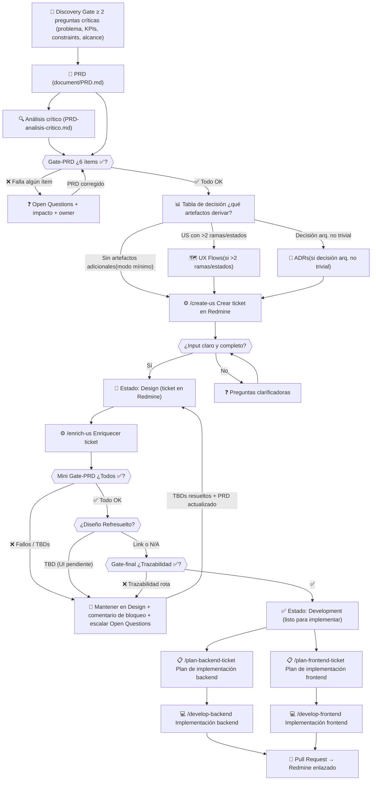

# Flujo de Desarrollo: PRD → Redmine → Listo para Desarrollo

Documento de referencia del proceso completo desde la definición de requisitos hasta que un ticket está listo para ser implementado. Sigue el estándar **SDD (Spec-Driven Development)** definido en `ai-specs/specs/prd-requirements-standards.md`.

**Principio rector (SDD):** cada artefacto derivado debe añadir información comprobable nueva respecto al PRD. No se reescribe ni duplica contenido; se refina.

---

## Diagrama general

> Referencia de GATE son las etapas de control y validación de documento.


---

## Fases detalladas

### Fase 0 — Discovery Gate (obligatorio, antes del PRD)

**Estándar:** `prd-requirements-standards.md`

Antes de escribir cualquier sección del PRD, se interroga al stakeholder con **mínimo 2 preguntas críticas**. No se escribe ninguna línea del PRD antes de recibir respuestas.

#### Preguntas núcleo (mínimo 2)

| # | Pregunta |
|---|---|
| 1 | **Core problem**: ¿qué dolor resuelve y qué pasa si no lo hacemos? |
| 2 | **Success metrics**: ¿cómo medimos éxito (KPIs) y contra qué baseline? |
| 3 | **Constraints**: ¿restricciones de tiempo, costo, stack, dependencias, integraciones? |
| 4 | **Alcance**: ¿qué incluye y qué NO incluye (non-goals)? |

**Regla de "hallucination":** si el stakeholder no define algo, convertirlo en pregunta o marcarlo como `TBD` con justificación — nunca asumir constraints.

---

### Fase 1 — PRD (Fuente de verdad)

**Artefacto:** `document/PRD.md`

El PRD es el único punto de verdad. Contiene:

| Sección | Descripción |
|---|---|
| Executive Summary | Problem Statement, Proposed Solution, Success Criteria (3-5 KPIs medibles) |
| User Experience & Functionality | User Personas, User Stories con IDs, Acceptance Criteria, Non-Goals |
| Technical Specifications | Architecture Overview, Data Structures, Integration Points, Security, Error Handling |
| Risks & Roadmap | Phased Rollout, Technical Risks, Open Questions para stakeholders |

**Análisis crítico complementario:** `document/PRD-analisis-critico.md`
Detecta inconsistencias, ambigüedades y TBDs. Sus preguntas abiertas a stakeholders deben tener respuesta antes de avanzar al Gate-PRD.

#### Nota sobre idioma en User Stories

El estándar SDD (`prd-requirements-standards.md`) define US y AC en inglés. El estándar de equipo (`base-standards.mdc`) define que los tickets de Redmine van en español. **Regla de precedencia:**
- **PRD:** US y AC en inglés (artefacto técnico de especificación).
- **Tickets Redmine:** Historia de Usuario y AC en español (artefacto de gestión).
- El traspaso de PRD → Redmine implica traducción y refinamiento, no copia directa.

---

### Fase 2 — Gate-PRD (antes de derivar cualquier artefacto)

**Estándar:** `prd-requirements-standards.md`

Ejecutar **antes** de crear tickets, UX Flows o ADRs. Si algún ítem falla, corregir el PRD primero.

#### Checklist Gate-PRD

| Ítem | Criterio | Estado |
|---|---|---|
| Semántica unívoca | ¿Las reglas de negocio tienen semántica sin ambigüedad: qué se calcula, cómo y cómo se combina el resultado? | ✅ / ❌ |
| Estructura del resultado | ¿El resultado esperado tiene estructura y tipos definidos (por entidad → atributos → valor)? | ✅ / ❌ |
| Condiciones "no aplica" | ¿Está definido el comportamiento cuando ninguna regla coincide (valor por defecto, null, error, omisión)? | ✅ / ❌ |
| Manejo de errores | ¿Qué falla, cómo se reporta y si el sistema continúa o aborta? | ✅ / ❌ |
| Idempotencia | ¿Re-ejecución: reemplazo vs acumulación vs bloqueo? | ✅ / ❌ |
| Estados/transiciones | ¿Todas las transiciones del recurso de dominio están definidas (incluyendo reaperturas, bloqueos)? | ✅ / ❌ |

Si algún ítem es ❌ → generar/actualizar Open Questions (`document/open-questions.md`) con impacto y owner sugerido antes de continuar.

---

### Fase 3 — Tabla de decisión de modo (mínimo vs completo)

**Estándar:** `prd-requirements-standards.md`

El **modo mínimo es el default**. El modo completo se activa solo cuando la tabla lo justifica.

| Condición | Artefacto adicional requerido |
|---|---|
| 1-3 US sin nuevas integraciones ni estados complejos | Solo PRD + AC verificables. No se generan artefactos separados. |
| US con >2 ramas de error, estados o decisiones no explícitas en el AC | UX Flow para esas US específicas |
| Integración externa nueva o cambio de contrato (API, esquema) | ADR de integración |
| Decisión arquitectónica no trivial (persistencia, semántica de dominio, idempotencia) | ADR |
| AC del PRD no es suficiente para mapear a pruebas sin reinterpretar el negocio | US refinada como archivo separado |
| >5 US o módulo de dominio nuevo con múltiples estados y reglas | Modo completo: UX Flows + US refinadas + ADRs |

**Regla de oro:** si un artefacto no añade información observable o comprobable que no esté ya en el PRD, **no se genera**.

#### Templates de artefactos

Para generar artefactos con estructura garantizada y consistente, usar los templates en `docs/templates/`:

| Artefacto | Template |
|---|---|
| ADR | `docs/templates/ADR-template.md` |
| UX Flow | `docs/templates/UX-Flow-template.md` |

#### Convención de rutas del proyecto

| Artefacto | Ruta en este proyecto |
|---|---|
| PRD | `document/PRD.md` |
| UX Flows | `document/ux-flows/UX-<id>-<slug>.md` |
| US refinadas | `document/user-stories/US-<id>-<slug>.md` |
| ADRs | `document/adrs/ADR-<nnn>-<slug>.md` |
| Open Questions | `document/open-questions.md` |
| Planes de implementación | `ai-specs/changes/[redmine_id]_backend.md` / `_frontend.md` |

> Esta convención diverge del default del estándar (`requirements/`) porque el proyecto usa `document/` como raíz. La divergencia es deliberada y está documentada aquí.

---

### Fase 4 — Crear ticket en Redmine (`/create-us`)

**Comando:** `ai-specs/.commands/create-us.md`

Solo se ejecuta después de que el Gate-PRD ha pasado y la tabla de decisión ha determinado los artefactos intermedios necesarios (si los hay).

#### Pasos internos

| Paso | Acción |
|---|---|
| 1 | Validar claridad del input; si hay ambigüedad, generar Preguntas Clarificadoras |
| 2 | Detectar modo: **SDD** (el input incluye `US-XX`) o **Libre** (sin ID de PRD) |
| 3 | Clasificar tipo de ticket y asignar prioridad sugerida |
| 4 | Generar contenido del ticket con estructura obligatoria |
| 5 | Crear el ticket en Redmine vía MCP |
| 6 | Confirmar trazabilidad al PRD (o advertir si falta) |

#### Estructura obligatoria del ticket

```
### Clasificación
- Tipo: [Historia de Usuario / Bug / Deuda técnica / ...]
- Prioridad sugerida: [Baja / Media / Alta / Crítica]
- Justificación: [1-2 frases]
- PRD Ref: [US-XX | N/A]
- Diseño Ref: [link | TBD | N/A — no requiere UI]

### Historia de Usuario
Como [rol], quiero [acción] para que [valor de negocio medible].

### Criterios de Aceptación (Gherkin)
- Dado que [...], cuando [...], entonces [...].
[≥1 caso de éxito, ≥1 caso de error/validación]

### Notas Técnicas y Riesgos
```

**Estado inicial en Redmine:** `Design`

#### Reglas clave

- Contenido narrativo en **español** (tickets Redmine); el PRD fuente está en inglés.
- `Diseño Ref` nunca puede quedar en blanco si la US tiene interacción visual.
- Seguir el principio **INVEST** (Independent, Negotiable, Valuable, Estimable, Small, Testable).
- Si la US se divide (ej. `US-6a` / `US-6b`), documentar trazabilidad a la `US-XX` padre en el campo PRD Ref.

---

### Fase 5 — Enriquecer ticket (`/enrich-us`)

**Comando:** `ai-specs/.commands/enrich-us.md`

#### Pasos internos

| Paso | Acción |
|---|---|
| 1 | Obtener el ticket de Redmine vía MCP |
| 2 | Verificar trazabilidad al PRD (`PRD Ref: US-XX`); si falta, solicitar confirmación |
| 3 | Ejecutar **Mini Gate-PRD** |
| 4 | Evaluar si el ticket necesita mejora; si ya es completo, confirmar y detener |
| 5 | Generar versión enhanced con dos capas separadas |
| 6 | Actualizar el ticket en Redmine (`[original]` + `[enhanced]`) |
| 7 | Transición de estado condicional |

#### Mini Gate-PRD (Paso 3)

Verifica que el ticket, como unidad de implementación, cumpla lo siguiente. No sustituye al Gate-PRD completo del PRD; es un control de calidad a nivel de ticket.

| Ítem | Criterio |
|---|---|
| AC verificables | ¿Los criterios son observables, no vagos? |
| Comportamiento ante errores | ¿Están definidos los casos de error/validación? |
| Ambigüedades de negocio | ¿Hay estados sin transición o reglas sin definir? |
| Idempotencia | ¿Se define qué pasa al re-ejecutar (si aplica al ticket)? |
| Diseño Ref | Si hay UI, ¿el campo tiene link confirmado o TBD justificado? |

Si hay ítems ❌ o TBDs bloqueantes → no pasar a Development + escalar a `document/open-questions.md` con impacto y owner si el TBD viene del PRD.

#### Versión enhanced: dos capas

**Capa 1 — Requerimientos** *(solo si hay defectos — no duplicar el PRD)*
- Historia de Usuario refinada (solo el delta respecto al PRD)
- Criterios de Aceptación Gherkin (≥1 éxito, ≥1 error)
- TBDs de requerimiento con impacto declarado

**Capa 2 — Detalle técnico** *(siempre)*
- Endpoints (método, URL, request body, response)
- Archivos a modificar
- Tests requeridos (unit, integration)
- Requisitos no funcionales (seguridad, rendimiento)
- Diseño de referencia + estados cubiertos (éxito, vacío, error, carga)
- Candidatos a ADR → si se identifica uno, generar `document/adrs/ADR-<nnn>-<slug>.md` antes de implementar

#### Transición de estado (Paso 7)

```
Si todos los ítems del Mini Gate-PRD son ✅
   Y no hay TBDs bloqueantes
   Y Diseño Ref tiene link confirmado (o es N/A)
   Y Gate-final pasa
→ Estado: Development

En cualquier otro caso
→ Mantener estado: Design
→ Añadir comentario con lista de ítems bloqueantes
→ Escalar TBDs de PRD a document/open-questions.md con impacto y owner
```

---

### Fase 6 — Gate-final (cierre del paquete de requerimientos)

**Estándar:** `prd-requirements-standards.md`

Ejecutar antes de marcar el ticket como Development. Valida integridad y trazabilidad del paquete completo.

#### Checklist Gate-final

| Ítem | Estado |
|---|---|
| ¿Identificadores y relaciones PRD ↔ UX Flows ↔ ticket están definidos sin contradicciones? | ✅ / ❓ |
| ¿Hay criterios de éxito medibles asociados a la historia? | ✅ / ❓ |
| ¿Cada AC puede mapearse a una prueba o contrato sin reinterpretar el negocio? | ✅ / ❓ |
| ¿Los artefactos generados (UX Flows, ADRs) añaden información nueva respecto al PRD (no son duplicación)? | ✅ / ❓ |

#### Activadores de dominio para este proyecto

**Dominio con estados y transiciones** (periodos, procesos):
- [ ] ¿Todas las transiciones de estado están definidas (incluyendo reaperturas, cancelaciones)?
- [ ] ¿Las transiciones requieren auditoría o motivo?

**Dominio con motor de reglas / DSL:**
- [ ] ¿La semántica de agregación de resultados múltiples está definida (suma, primero que aplica, otro)?
- [ ] ¿El comportamiento ante expresión sin resultado (ninguna condición verdadera) está especificado?
- [ ] ¿Las funciones de dominio tienen semántica unívoca (case-sensitivity, orden de evaluación)?

**Dominio con integraciones externas (API ERP):**
- [ ] ¿El flujo de obtención de datos está definido (por empleado, por lote, caché, reintentos)?
- [ ] ¿La validación del contrato de integración está especificada (esquema estático, respuesta de prueba, o ambos)?
- [ ] ¿El comportamiento ante campos ausentes o null en la respuesta del ERP está definido?

---

### Fase 7 — Planificación de implementación

Una vez el ticket está en estado `Development`, se generan los planes de implementación.

#### Backend — `/plan-backend-ticket`

**Comando:** `ai-specs/.commands/plan-backend-ticket.md`
**Output:** `ai-specs/changes/[redmine_id]_backend.md`

- Contexto de arquitectura (DDD: Domain / Application / Presentation)
- Step 0: Crear feature branch (`feature/[ticket-id]-backend`)
- Steps de implementación (validación, servicio, controller, ruta)
- Step final: Actualizar documentación técnica
- Testing checklist y formato de error responses

#### Frontend — `/plan-frontend-ticket`

**Comando:** `ai-specs/.commands/plan-frontend-ticket.md`
**Output:** `ai-specs/changes/[redmine_id]_frontend.md`

- Contexto de arquitectura frontend (component-based, service layer)
- Step 0: Crear feature branch (`feature/[ticket-id]-frontend`)
- Steps de implementación (servicios, componentes, routing)
- Consideraciones UI/UX y accesibilidad
- Step final: Actualizar documentación técnica

---

### Fase 8 — Implementación

#### Backend — `/develop-backend`

1. Entender el problema del ticket
2. Encontrar archivos relevantes en el codebase
3. Crear branch (`feature/[ticket-id]-backend`)
4. Implementar, escribir y ejecutar tests, asegurar lint y type checking
5. Stage de archivos afectados, commit descriptivo
6. Push y creación de PR enlazado al ticket Redmine

#### Frontend — `/develop-frontend`

1. Analizar el diseño desde la URL de referencia
2. Generar plan de componentes (atoms → molecules → organisms → page)
3. Implementar componentes React, estilos y elementos reutilizables
4. Seguir el Feedback Loop para gestionar correcciones

> Si durante la implementación se descubren ambigüedades nuevas del dominio → actualizar `document/PRD.md` en la sección afectada y registrar en `document/open-questions.md` si quedan TBDs pendientes.

---

## Resumen de estados en Redmine

```
[Discovery Gate]
      │
      ▼
   [PRD]  ←─── PRD-analisis-critico.md
      │
   [Gate-PRD] ─── ❌ → Open Questions → corregir PRD → volver
      │ ✅
   [Tabla de decisión]
      ├── UX Flows (si aplica)  →  document/ux-flows/
      ├── ADRs (si aplica)      →  document/adrs/
      └── (modo mínimo: directo a tickets)
      │
      ▼
   Design  (ticket creado por /create-us)
      │
   /enrich-us
      ├── Mini Gate-PRD ❌ o TBDs → mantener Design + escalar Open Questions
      │
      └── Mini Gate-PRD ✅ + Diseño Ref resuelto
            │
         [Gate-final] ─── ❌ → mantener Design
            │ ✅
            ▼
         Development  (listo para implementar)
            │
            ├── /plan-backend-ticket  → ai-specs/changes/[id]_backend.md
            ├── /plan-frontend-ticket → ai-specs/changes/[id]_frontend.md
            │
            ├── /develop-backend  → branch feature/[id]-backend → PR
            └── /develop-frontend → branch feature/[id]-frontend → PR
```

---

## Checklist de gates

### Gate 0 — Discovery (antes del PRD)

- [ ] Se hicieron ≥2 preguntas críticas al stakeholder (problema, KPIs, constraints, alcance)
- [ ] No se asumieron constraints no declarados
- [ ] Las respuestas recibidas son suficientes para iniciar el PRD

### Gate 1 — Gate-PRD (antes de derivar artefactos)

- [ ] Semántica de reglas de negocio unívoca
- [ ] Estructura y tipo del resultado esperado definidos
- [ ] Comportamiento ante "no aplica" definido
- [ ] Manejo de errores definido a nivel de requerimiento
- [ ] Idempotencia definida (si aplica)
- [ ] Estados y transiciones del recurso de dominio definidos

### Gate 2 — Antes de crear el ticket (`/create-us`)

- [ ] Gate-PRD completo superado
- [ ] Tabla de decisión ejecutada y artefactos intermedios generados (si aplica)
- [ ] El input tiene claro el valor de negocio, el actor y el comportamiento esperado
- [ ] La US tiene trazabilidad a una `US-XX` del PRD (modo SDD) o el riesgo está aceptado explícitamente
- [ ] `Diseño Ref` está definido: link, TBD o N/A

### Gate 3 — Antes de pasar a Development (`/enrich-us` + Gate-final)

- [ ] Todos los AC son verificables (no vagos)
- [ ] Comportamiento ante errores/validaciones definido
- [ ] Idempotencia definida (si aplica al ticket)
- [ ] No hay ambigüedades de negocio sin resolver (o están en `document/open-questions.md`)
- [ ] Si hay UI: `Diseño Ref` tiene link confirmado (no TBD)
- [ ] Gate-final superado (trazabilidad PRD ↔ ticket verificada)
- [ ] ADRs generados para decisiones arquitectónicas no triviales identificadas

### Gate 4 — Antes de hacer PR

- [ ] Tests escritos y pasando
- [ ] Lint y type checking sin errores
- [ ] Documentación técnica actualizada (`ai-specs/changes/`, `ai-specs/specs/`)
- [ ] Commit descriptivo en español con referencia al ticket
- [ ] Si se encontraron ambigüedades nuevas: PRD actualizado y Open Questions registradas

---

## Anti-patrones (MUST NOT)

Los siguientes comportamientos rompen el apego a SDD:

| Anti-patrón | Impacto |
|---|---|
| Crear tickets sin haber pasado el Gate-PRD | Los tickets heredan ambigüedades del PRD y se bloquean en Design |
| Reescribir en el ticket lo que ya dice el PRD sin añadir detalle | Duplicación; viola el principio "refinamiento, no duplicación" |
| Generar UX Flows o ADRs sin trigger justificado | Genera artefactos que no añaden información comprobable nueva |
| Tratar TBDs solo como bloqueos de ticket sin escalar | Las preguntas sin owner no se resuelven; el bloqueo se vuelve permanente |
| Asumir constraints no declarados (en PRD, ticket o implementación) | Introduce semánticas que no fueron validadas por el negocio |
| Pasar a Development con `Diseño Ref: TBD` en US con UI | El desarrollador implementa sin referencia de diseño confirmada |
| Implementar sin branch dedicado y PR enlazado al ticket | Rompe la trazabilidad código ↔ ticket ↔ PRD |

---

## Referencias

| Artefacto | Ruta |
|---|---|
| Estándar SDD | `ai-specs/specs/prd-requirements-standards.md` |
| Estándares base | `ai-specs/specs/base-standards.mdc` |
| Estándares backend | `ai-specs/specs/backend-standards.mdc` |
| Estándares frontend | `ai-specs/specs/frontend-standards.mdc` |
| Estándares de documentación | `ai-specs/specs/documentation-standards.mdc` |
| PRD | `document/PRD.md` |
| Análisis crítico del PRD | `document/PRD-analisis-critico.md` |
| Open Questions | `document/open-questions.md` |
| UX Flows | `document/ux-flows/` |
| ADRs | `document/adrs/` |
| Comando create-us | `ai-specs/.commands/create-us.md` |
| Comando enrich-us | `ai-specs/.commands/enrich-us.md` |
| Comando plan-backend-ticket | `ai-specs/.commands/plan-backend-ticket.md` |
| Comando plan-frontend-ticket | `ai-specs/.commands/plan-frontend-ticket.md` |
| Comando develop-backend | `ai-specs/.commands/develop-backend.md` |
| Comando develop-frontend | `ai-specs/.commands/develop-frontend.md` |
| Planes de implementación | `ai-specs/changes/` |
