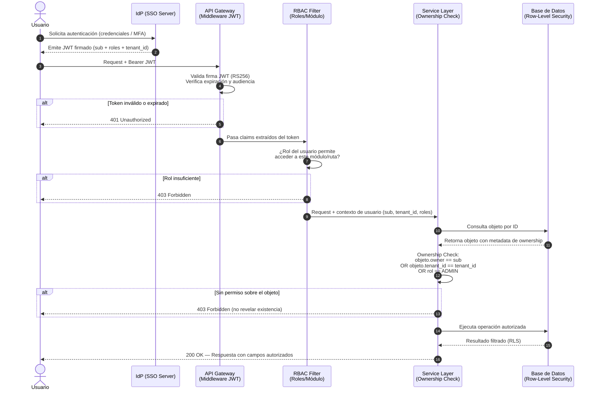

# Estándares de Seguridad

> **Documento unificado:** Requisitos IDOR, SSO, estándar del gateway y cumplimiento del Checklist obligatorio IDOR.  
> **Referencia:** OWASP Top 10 / OWASP API Security 2023 (API1:BOLA).  
> **Evidencia:** Toda la información generada como evidencia de cumplimiento se almacena en la carpeta `evidence/` en la raíz del proyecto (véase Parte V).

---

## Índice

- [Requisitos de seguridad y IDOR](#requisitos-de-seguridad-y-idor)
  - [1.1 Referencia al checklist oficial](#11-referencia-al-checklist-oficial)
  - [1.2 Definiciones](#12-definiciones)
  - [1.3 Requisitos AC1–AC11 (Validación de autorización y acceso)](#13-requisitos-ac1ac11-validación-de-autorización-y-acceso)
  - [1.4 Ejemplo de prueba E2E (IDOR)](#14-ejemplo-de-prueba-e2e-idor)
- [Autenticación centralizada (SSO) y flujos](#autenticación-centralizada-sso-y-flujos)
  - [2.1 Propósito y alcance](#21-propósito-y-alcance)
  - [2.2 Requisitos No Funcionales de Seguridad](#22-requisitos-no-funcionales-de-seguridad)
  - [2.3 Estructura del Token JWT (Claims Requeridos)](#23-estructura-del-token-jwt-claims-requeridos)
  - [2.4 Flujo integrado: SSO + Autorización Anti-IDOR](#24-flujo-integrado-sso-autorización-anti-idor)
  - [2.5 Especificación de comportamiento (Gherkin)](#25-especificación-de-comportamiento-gherkin)
  - [2.6 Controles de implementación por capa](#26-controles-de-implementación-por-capa)
  - [2.7 Matriz de amenazas mitigadas](#27-matriz-de-amenazas-mitigadas)
- [Estándar del middleware (Gateway)](#estándar-del-middleware-gateway)
  - [3.1 Propósito](#31-propósito)
  - [3.2 Línea base de implementación (obligatoria)](#32-línea-base-de-implementación-obligatoria)
  - [3.3 Alcance y no objetivos](#33-alcance-y-no-objetivos)
  - [3.4 Principios fundamentales](#34-principios-fundamentales)
  - [3.5 Requisitos funcionales](#35-requisitos-funcionales)
  - [3.6 Requisitos de seguridad (OWASP A01 / enfoque IDOR)](#36-requisitos-de-seguridad-owasp-a01-enfoque-idor)
  - [3.7 Limitación de tasa y protección ante abuso](#37-limitación-de-tasa-y-protección-ante-abuso)
  - [3.8 Registro, auditoría y telemetría](#38-registro-auditoría-y-telemetría)
  - [3.9 Alertas y disparadores de incidentes](#39-alertas-y-disparadores-de-incidentes)
  - [3.10 Valores por defecto de política de referencia](#310-valores-por-defecto-de-política-de-referencia)
  - [3.11 Lista de comprobación de implementación (preproducción)](#311-lista-de-comprobación-de-implementación-preproducción)
  - [3.12 Requisitos de verificación y pruebas](#312-requisitos-de-verificación-y-pruebas)
  - [3.13 Plantilla de registro de decisiones](#313-plantilla-de-registro-de-decisiones)
- [Gaps del checklist](#gaps-del-checklist)
  - [4.1 E4 — Rotación de credenciales ante riesgos de exposición](#41-e4-rotación-de-credenciales-ante-riesgos-de-exposición)
  - [4.2 F1 — Inventario de sistemas/APIs expuestos a Internet](#42-f1-inventario-de-sistemasapis-expuestos-a-internet)
  - [4.3 F2 — Servicios no necesarios retirados, deshabilitados o aislados](#43-f2-servicios-no-necesarios-retirados-deshabilitados-o-aislados)
  - [4.4 F3 — Restricción de acceso a redes o servicios autorizados](#44-f3-restricción-de-acceso-a-redes-o-servicios-autorizados)
- [Cumplimiento checklist IDOR y evidencia](#cumplimiento-checklist-idor-y-evidencia)
  - [5.1 Referencia al checklist oficial](#51-referencia-al-checklist-oficial)
  - [5.2 Mapeo ítems del checklist (A–F) a este documento](#52-mapeo-ítems-del-checklist-a-f-a-este-documento)
  - [5.3 Evidencia requerida (según checklist)](#53-evidencia-requerida-según-checklist)
  - [5.4 Proceso y estándar de generación de evidencia](#54-proceso-y-estándar-de-generación-de-evidencia)
  - [5.5 Ubicación de la evidencia — Regla obligatoria](#55-ubicación-de-la-evidencia-regla-obligatoria)
  - [5.6 Referencias](#56-referencias)

---

# Requisitos de seguridad y IDOR

> **Nota sobre skills:** El skill `api-security-best-practices` proporciona principios generales de seguridad en APIs (autenticación, validación de input, rate limiting). **No aborda** los requerimientos específicos de este documento: IDOR/BOLA (AC1–AC11), SSO centralizado con JWT, gateway middleware Nginx ni el proceso de generación de evidencia en `evidence/`. Este estándar es la **fuente autoritativa**; el skill es únicamente un complemento genérico de apoyo y no debe usarse como sustituto del checklist IDOR del proyecto.

## 1.1 Referencia al checklist oficial

Este documento está alineado con el **Checklist de cumplimiento obligatorio IDOR**. El mapeo detallado de ítems del checklist (A–F) a las partes de este documento se encuentra en la **Parte V**.

## 1.2 Definiciones

| Término | Definición |
|--------|------------|
| **SSO** | Mecanismo de autenticación centralizada; el usuario se autentica una sola vez para acceder a múltiples módulos. |
| **IdP** | Identity Provider — servidor que emite y firma los tokens de identidad (JWT/SAML). |
| **SP** | Service Provider — cada módulo del sistema que consume los tokens del IdP. |
| **IDOR / BOLA** | Vulnerabilidad donde un usuario autenticado accede a objetos que no le pertenecen manipulando identificadores. |
| **RBAC** | Role-Based Access Control — control de acceso basado en roles globales del sistema. |
| **ABAC** | Attribute-Based Access Control — control de acceso basado en atributos del objeto y del sujeto. |
| **Ownership Check** | Verificación server-side de que el usuario autenticado es propietario o tiene permiso explícito sobre un objeto específico. |
| **tenant_id** | Identificador de la unidad organizacional o dependencia a la que pertenece el usuario. |

## 1.3 Requisitos AC1–AC11 (Validación de autorización y acceso)

### 1. Validación de Autorización y Acceso (IDOR)

- **AC1 — Validación de Pertenencia del Recurso:** Dado un usuario autenticado, cuando intente acceder o modificar un recurso (vía ID) que no le pertenece, el sistema debe denegar la transacción con un código de error HTTP 403 Forbidden o 404 Not Found.
- **AC2 — Independencia de la Sesión:** El sistema no debe asumir que una sesión válida otorga permisos automáticos sobre cualquier objeto; cada petición debe validar explícitamente que el usuario de la sesión tiene derechos sobre el ID solicitado.
- **AC3 — Resistencia a la Manipulación de Identificadores:** El uso de UUIDs o hashes no debe ser el único mecanismo de seguridad; el backend debe realizar la validación lógica de propiedad incluso si el identificador es complejo o no predecible.

### 2. Seguridad en Endpoints y Métodos HTTP

- **AC4 — Cobertura Total de Métodos:** Todos los métodos habilitados (GET, POST, PUT, PATCH, DELETE) deben aplicar los mismos niveles de restricción de seguridad y validación de tokens.
- **AC5 — Consistencia de Versiones:** Las versiones anteriores de la API (ej. /v1/) deben mantener los mismos controles de seguridad que la versión actual, evitando brechas por regresión.
- **AC6 — Integridad del Formato:** El cambio de formato en el payload (ej. de JSON a XML o viceversa) no debe permitir saltarse las reglas de validación de acceso establecidas.

### 3. Flujos Secundarios y Visibilidad

- **AC7 — Protección de Recursos en Flujos Indirectos:** Los endpoints de búsqueda, reportes o exportación masiva no deben exponer datos de terceros al filtrar o listar recursos.
- **AC8 — Prevención de IDOR Ciego:** Las respuestas del sistema no deben revelar información sensible sobre la existencia o estructura de recursos ajenos a través de diferencias en tiempos de respuesta o mensajes de error específicos.

### 4. Resiliencia y Monitoreo Operativo

- **AC9 — Control de Tasa (Rate Limiting):** Ante ráfagas de peticiones sospechosas hacia endpoints sensibles, el sistema debe activar mecanismos de throttling y responder con un código HTTP 429 Too Many Requests.
- **AC10 — Trazabilidad de Accesos No Autorizados:** Cada intento de violación de seguridad (especialmente fallos de autorización a nivel de objeto) debe generar un log de auditoría que incluya el usuario, la IP y el recurso afectado.
- **AC11 — Restricción de Red y Exposición:** Solo los servicios y redes previamente autorizados deben tener visibilidad hacia los endpoints productivos, manteniendo aislados aquellos servicios que no requieran exposición pública.

## 1.4 Ejemplo de prueba E2E (IDOR)

```gherkin
Escenario: Intento de acceso no autorizado a factura de otro cliente.
  Dado que soy el "Usuario A" con un token JWT válido.
  Y existe una factura con ID 999 que pertenece al "Usuario B".
  Cuando envío una petición GET /api/v1/facturas/999.
  Entonces el sistema debe responder con un código 403 Forbidden.
  Y el cuerpo de la respuesta no debe contener datos del "Usuario B".
```

---

# Autenticación centralizada (SSO) y flujos

## 2.1 Propósito y alcance

- **Autenticación centralizada** mediante Single Sign-On (SSO).
- **Autorización granular** para prevenir IDOR/BOLA.

Aplica a todos los módulos del sistema: contabilidad, organigrama, nómina, presupuesto y cualquier nuevo módulo incorporado.

## 2.2 Requisitos No Funcionales de Seguridad

- **RNF-SEC-01:** Toda autenticación debe pasar por el IdP centralizado. Queda prohibida la autenticación local por módulo.
- **RNF-SEC-02:** El token JWT debe firmarse con algoritmo `RS256`. Queda prohibido el uso de `none` o `HS256` con secreto compartido.
- **RNF-SEC-03:** Ningún endpoint debe resolver un objeto basándose únicamente en el ID recibido del cliente sin verificar ownership.
- **RNF-SEC-04:** Los identificadores expuestos en URLs y cuerpos de respuesta deben ser UUIDs v4, no claves secuenciales de base de datos.
- **RNF-SEC-05:** Las respuestas de acceso denegado por razones de ownership deben retornar `403 Forbidden`, nunca `404 Not Found` ni detalles internos.
- **RNF-SEC-06:** Los tokens JWT deben tener tiempo de expiración máximo de 8 horas para sesiones interactivas y 1 hora para acceso API.
- **RNF-SEC-07:** Todos los eventos de autenticación y acceso denegado deben registrarse en el log de auditoría centralizado.

## 2.3 Estructura del Token JWT (Claims Requeridos)

```json
{
  "sub": "uuid-del-usuario",
  "iss": "https://idp.sistema.gob.mx",
  "aud": "erp-grp-sistema",
  "exp": 1700000000,
  "iat": 1699996400,
  "roles": ["CONTADOR", "CONSULTOR_PRESUPUESTAL"],
  "tenant_id": "DEP-FINANZAS-001",
  "permissions": ["presupuesto:read", "contabilidad:write"]
}
```

> **Restricción:** No incluir datos sensibles del negocio (nombres, CURP, RFC) en el payload del token.

## 2.4 Flujo integrado: SSO + Autorización Anti-IDOR



## 2.5 Especificación de comportamiento (Gherkin)

### Autenticación SSO

```gherkin
Feature: Autenticación centralizada mediante SSO

  Scenario: Usuario accede a módulo sin sesión activa
    Given el usuario no tiene sesión SSO activa
    When intenta acceder al módulo de contabilidad
    Then el sistema redirige al IdP centralizado
    And el IdP solicita credenciales y segundo factor

  Scenario: Usuario con sesión SSO activa accede a segundo módulo
    Given el usuario tiene una sesión SSO activa con token válido
    When accede al módulo de nómina por primera vez
    Then el sistema valida el token existente con el IdP
    And concede acceso sin solicitar credenciales nuevamente

  Scenario: Token JWT expirado
    Given el usuario presenta un token JWT expirado
    When realiza cualquier petición a cualquier módulo
    Then el sistema retorna 401 Unauthorized
    And el cliente debe redirigir al flujo de reautenticación
```

### Control de acceso por rol (RBAC)

```gherkin
Feature: Control de acceso basado en roles

  Scenario: Rol insuficiente para el módulo
    Given el usuario autenticado tiene rol "CONSULTOR_PRESUPUESTAL"
    When intenta acceder al endpoint POST /api/nomina/pagos
    Then el sistema retorna 403 Forbidden
    And el evento queda registrado en el log de auditoría

  Scenario: Acceso autorizado por rol
    Given el usuario autenticado tiene rol "CONTADOR"
    When accede al endpoint GET /api/contabilidad/polizas
    Then el sistema permite el acceso
    And retorna únicamente las pólizas de su tenant_id
```

### Prevención IDOR — Ownership Check

```gherkin
Feature: Prevención de IDOR mediante verificación de ownership

  Scenario: Usuario intenta acceder a objeto de otro usuario
    Given el usuario "usuario-A" está autenticado con tenant_id "DEP-001"
    And existe un presupuesto con id "uuid-9999" perteneciente a "DEP-002"
    When "usuario-A" realiza GET /api/presupuesto/uuid-9999
    Then el sistema retorna 403 Forbidden
    And no revela si el objeto existe o no

  Scenario: Usuario accede a su propio objeto
    Given el usuario "usuario-A" está autenticado con tenant_id "DEP-001"
    And existe un presupuesto con id "uuid-1111" perteneciente a "DEP-001"
    When "usuario-A" realiza GET /api/presupuesto/uuid-1111
    Then el sistema retorna 200 OK con los datos del presupuesto

  Scenario: Administrador accede a cualquier objeto
    Given el usuario autenticado tiene rol "ADMIN"
    When accede a GET /api/presupuesto/uuid-9999 de cualquier tenant
    Then el sistema retorna 200 OK
    And el acceso queda registrado en el log de auditoría con nivel INFO
```

## 2.6 Controles de implementación por capa

### IdP / SSO
- [ ] Configurar IdP (Keycloak / Azure AD) con firmado RS256.
- [ ] Definir mappers para incluir `roles`, `tenant_id` y `permissions` en el JWT.
- [ ] Habilitar MFA obligatorio para roles administrativos.
- [ ] Configurar rotación de claves de firma (JWKS endpoint).

### API Gateway / Middleware
- [ ] Implementar filtro global de validación JWT (`JwtAuthenticationFilter`).
- [ ] Validar: firma, expiración, audiencia (`aud`) e issuer (`iss`).
- [ ] Rechazar tokens con algoritmo `none`.
- [ ] Propagar claims como `SecurityContext` hacia capas internas.

### Capa de Servicio (Anti-IDOR)
- [ ] Implementar componente `OwnershipValidator` reutilizable.
- [ ] Cada método de servicio que opere sobre un objeto debe invocar `OwnershipValidator` antes de la operación.
- [ ] Usar `@PreAuthorize` con SpEL para validaciones declarativas donde aplique.
- [ ] Derivar siempre el sujeto desde `SecurityContextHolder`, nunca desde parámetros del request.

### Persistencia
- [ ] Usar UUIDs v4 como PK expuesta en APIs (pueden coexistir con PK numérica interna).
- [ ] Considerar Row-Level Security (RLS) en PostgreSQL como segunda línea de defensa.
- [ ] Nunca exponer la PK numérica secuencial en respuestas de API.

## 2.7 Matriz de amenazas mitigadas

| Amenaza | OWASP Ref | Mitigación aplicada |
|---------|-----------|---------------------|
| Robo de sesión por credenciales débiles | A07:2021 | SSO + MFA obligatorio |
| Acceso no autorizado a módulos | A01:2021 Broken Access Control | RBAC en middleware |
| IDOR / BOLA — acceso a objetos ajenos | API1:2023 BOLA | Ownership Check en Service Layer |
| Enumeración de objetos por IDs secuenciales | A01:2021 | UUIDs v4 en APIs |
| Escalación de privilegios horizontal | A01:2021 | tenant_id check en ownership |
| Token manipulado o forjado | A02:2021 Crypto Failures | Validación firma RS256 + JWKS |

---

# Estándar del middleware (Gateway)

Esta sección utiliza los términos RFC 2119: **MUST**, **SHOULD**, **MAY**.

## 3.1 Propósito

El gateway es el único punto de entrada controlado para el tráfico de clientes externos e internos y es responsable de:

- Enrutamiento de peticiones a los servicios backend
- Autenticación y autorización
- Validación JWT y comprobaciones del ciclo de vida del token
- Limitación de tasa (rate limiting) y protección ante abuso
- Aplicación de seguridad con especial foco en la prevención de IDOR
- Registro de auditoría, seguimiento de intentos fallidos y alertas

## 3.2 Línea base de implementación (obligatoria)

La implementación del middleware gateway MUST utilizar la siguiente pila de referencia:

- **Lenguaje**: Java 21 (JDK: distribución OpenJDK, p. ej. Eclipse Temurin; no Oracle JDK)
- **Framework**: Spring Boot 3.x
- **Framework de seguridad**: Spring Security 6.x
- **Herramienta de construcción**: Maven
- **Almacenamiento principal para registros de control de login**: PostgreSQL

Todas las decisiones de implementación, dependencias y artefactos de despliegue MUST permanecer compatibles con esta línea base salvo que exista una excepción aprobada documentada en el registro de decisiones.

## 3.3 Alcance y no objetivos

**Dentro del alcance:** Gateway de peticiones HTTP/HTTPS; mapeo de rutas API y envío a servicios; controles de seguridad para decisiones de acceso; registro y telemetría de seguridad estandarizados.

**Fuera del alcance:** Lógica de negocio dentro de microservicios downstream; políticas de autorización directas en base de datos; flujos de autenticación en UI más allá de los contratos de API.

## 3.4 Principios fundamentales

1. **Denegar por defecto**: Cualquier petición sin permiso explícito MUST ser rechazada.
2. **Confianza cero entre servicios**: Toda petición MUST ser validada, incluso en redes internas.
3. **Mínimo privilegio**: Las concesiones de acceso MUST incluir solo los permisos necesarios.
4. **Defensa en profundidad**: Autenticación, autorización, limitación de tasa y detección de anomalías MUST combinarse.
5. **Trazabilidad**: Toda acción relevante para la seguridad MUST producir registros auditables.
6. **Identificadores seguros no son autorización**: Los IDs no secuenciales reducen la exposición pero nunca sustituyen las comprobaciones de ownership.

## 3.5 Requisitos funcionales

### Enrutamiento y acceso a servicios

- El gateway MUST enrutar peticiones por path, método y versión (p. ej. `/api/v1/users/*`).
- Los mapeos ruta–servicio MUST estar definidos de forma centralizada y bajo control de versiones.
- Cada ruta MUST tener una política de acceso explícita (pública, autenticada, por rol, servicio a servicio).
- Los ÚNICOS endpoints públicos MUST ser los de login y logout (p. ej. `/auth/login`, `/auth/logout`).
- El resto de endpoints MUST requerir autenticación y autorización por defecto.
- La exposición pública de endpoints adicionales (docs, actuator, health) MUST estar bloqueada salvo que exista una excepción aprobada explícita en el registro de decisiones.
- El gateway MUST rechazar peticiones a rutas desconocidas con `404` o `403` y registrar el evento.

### Autenticación (login)

- El gateway MUST proporcionar o delegar los endpoints de login de forma segura.
- Los intentos de login fallidos MUST registrarse por: identificador de cuenta, IP de origen, huella de dispositivo (si está disponible).
- Los intentos fallidos repetidos MUST activar una política temporal de throttling o lockout.
- Los endpoints de login MUST devolver mensajes de error genéricos (sin filtración de existencia de usuario).

### Persistencia de control de login (PostgreSQL)

- Los registros de control de login MUST persistirse en PostgreSQL.
- El esquema MUST capturar como mínimo: tipo de evento (`LOGIN_SUCCESS`, `LOGIN_FAILURE`, `LOCKOUT`, `CHALLENGE`, `TOKEN_REFRESH`), marca temporal del evento (UTC), identificador de usuario/cuenta, IP de origen y user agent, huella de dispositivo, servicio o categoría de ruta objetivo, código de razón de decisión.
- MUST existir índices en PostgreSQL para `event_timestamp`, `account_identifier`, `source_ip`, e índices compuestos para detección de lockout y enumeración.
- La política de retención MUST estar configurada y documentada explícitamente.

### Manejo de JWT

- Los JWT MUST firmarse con algoritmos fuertes (RS256/ES256 preferidos; HS256 solo con gestión segura del secreto).
- El gateway MUST validar como mínimo: firma, `exp`, `nbf` (si está presente), `iss`, `aud`, `sub`, `jti` (cuando la revocación está habilitada).
- La vida del access token SHOULD ser corta (p. ej. 5–15 minutos).
- Los refresh tokens MUST almacenarse y rotarse de forma segura.
- Los tokens revocados o reutilizados MUST ser denegados y registrados.

### Requisitos de Spring Security

- Los controles de seguridad MUST implementarse con la cadena de filtros de Spring Security (`SecurityFilterChain`).
- La autorización MUST seguir la semántica denegar-por-defecto (equivalente a `anyRequest().authenticated()`).
- La gestión de sesión MUST ser sin estado para APIs basadas en JWT.
- Las contraseñas MUST almacenarse solo como hashes adaptativos fuertes (Argon2id o BCrypt).
- La autorización a nivel de método (`@PreAuthorize` o equivalente) SHOULD usarse para operaciones sensibles.
- Los manejadores de excepciones de autenticación/autorización MUST devolver payloads de error estandarizados sin filtrar detalles sensibles.

## 3.6 Requisitos de seguridad (OWASP A01 / enfoque IDOR)

### Controles IDOR obligatorios

- Para cada petición a nivel de objeto (`/users/{id}`, `/orders/{id}`, `/files/{id}`), el gateway y/o la capa de autorización downstream MUST verificar: identidad autenticada; ownership del objeto solicitado O alcance de tenencia permitido O privilegio de administrador concedido.
- El sistema MUST NOT apoyarse en la complejidad del identificador (UUID/hash) como evidencia de autorización.
- Los IDs expuestos en las APIs MUST ser no secuenciales y no predecibles cuando sea factible.
- Los intentos de acceso no autorizado a objetos MUST devolver `403` y MUST registrarse como eventos de seguridad.

### Controles anti-enumeración

- El gateway MUST detectar intentos de acceso repetidos a múltiples IDs de objeto en ventanas cortas.
- El gateway MUST disparar alertas ante sospecha de enumeración masiva.
- La lógica de correlación de enumeración y fuerza bruta SHOULD consultar en PostgreSQL los registros de control de login y de denegación de acceso usando ventanas temporales acotadas.

### Modelo de decisión de acceso

Toda petición protegida MUST superar: (1) Identidad autenticada, (2) Token válido, (3) Permiso de ruta válido, (4) Autorización a nivel de objeto válida, (5) Límite de tasa no excedido. Si falla cualquier comprobación, el acceso MUST ser denegado.

## 3.7 Limitación de tasa y protección ante abuso

- El gateway MUST aplicar límites de tasa por IP, por usuario/cuenta, por token/cliente y por categoría de endpoint (login, lectura intensiva, escritura intensiva, administración).
- Los límites excedidos MUST devolver `429 Too Many Requests` con metadatos de reintento.

## 3.8 Registro, auditoría y telemetría

El gateway MUST registrar: éxito/fallo de autenticación, denegaciones de autorización (`403`), fallos de validación de token, denegaciones por límite de tasa (`429`), patrones de enumeración sospechosos, ruta/servicio objetivo.

Los logs de seguridad MUST incluir como mínimo: marca temporal (UTC), correlation ID / trace ID, user ID, tenant ID, IP de origen y user agent, método HTTP y plantilla de ruta, nombre del servicio objetivo, resultado de la decisión, código de razón de decisión (p. ej. `TOKEN_EXPIRED`, `OBJECT_NOT_OWNED`, `RATE_LIMIT_EXCEEDED`).

## 3.9 Alertas y disparadores de incidentes

El gateway MUST enviar alertas cuando: intentos de login fallidos repetidos; ráfaga de `403`/`404` en endpoints de objetos; replay/revocación de token por encima del umbral; aumento repentino de `429`. Cada alerta MUST incluir contexto del actor, servicios/rutas afectados, ventana temporal y métricas de conteo, acción de respuesta inicial sugerida.

## 3.10 Valores por defecto de política de referencia

- TTL del access token: 10 minutos; TTL del refresh token: 7–30 días.
- Lockout de login: bloqueo temporal tras 5 intentos fallidos en 15 minutos.
- Alerta de enumeración IDOR: 20 o más peticiones de objeto denegadas en 2 minutos por actor.
- Límite de tasa global de respaldo: 100 peticiones/minuto por usuario autenticado.

Todos los umbrales MUST ser configurables mediante configuración segura de entorno.

## 3.11 Lista de comprobación de implementación (preproducción)

- [ ] Existe inventario de rutas y todas las rutas tienen política de acceso explícita
- [ ] Solo los endpoints de login/logout son públicos
- [ ] La cadena de filtros de Spring Security aplica autorización denegar-por-defecto
- [ ] La validación JWT aplica firma, issuer, audiencia, expiración y política de revocación
- [ ] Existen comprobaciones de autorización a nivel de objeto para todos los endpoints basados en objetos
- [ ] Los identificadores UUID/hash no se tratan como autorización de acceso
- [ ] Los fallos de login se registran y el lockout/throttling está activo
- [ ] Los eventos de control de login se persisten en PostgreSQL con los índices requeridos
- [ ] Los límites de tasa están activos por IP, usuario y clase de endpoint
- [ ] Los logs de seguridad incluyen los campos requeridos y los códigos de razón de decisión
- [ ] Las alertas están configuradas para logins fallidos y enumeración masiva
- [ ] Los casos de prueba de seguridad incluyen escenarios IDOR y de enumeración

## 3.12 Requisitos de verificación y pruebas

- Pruebas unitarias de la lógica de validación de token y de política
- Pruebas de integración: acceso no autenticado denegado para todo endpoint excepto login/logout
- Pruebas de integración para rutas protegidas y comprobaciones de ownership de objetos
- Pruebas negativas para intentos IDOR (acceso a objeto de otro usuario)
- Pruebas de carga que validen el comportamiento del límite de tasa

La aprobación de release MUST bloquearse si fallan pruebas críticas de IDOR o de control de acceso.

## 3.13 Plantilla de registro de decisiones

- **Decision ID**: …
- **Topic**: (p. ej. política de lockout, TTL de token)
- **Options considered**: …
- **Chosen option**: …
- **Owner**: …
- **Date**: …
- **Rationale**: …

---

# Gaps del checklist

Esta parte cubre los ítems del Checklist obligatorio IDOR que deben documentarse explícitamente. La evidencia generada se almacena en la carpeta `evidence/` (Parte V).

## 4.1 E4 — Rotación de credenciales ante riesgos de exposición

**Requisito:** Se debe contar con procedimiento de rotación de credenciales (contraseñas, tokens, llaves de API, sesiones activas) cuando se identifiquen vulnerabilidades o riesgos de acceso indebido.

**Cumplimiento esperado:**
- Procedimiento documentado para rotar contraseñas, tokens, llaves de API o invalidar sesiones activas.
- Capacidad técnica para invalidar o rotar credenciales en respuesta a incidentes.

**Evidencia esperada:** Procedimiento documentado o registros de rotación. Los documentos y registros de evidencia se almacenan en `evidence/` según la convención indicada en la Parte V.

## 4.2 F1 — Inventario de sistemas/APIs expuestos a Internet

**Requisito:** Debe existir inventario actualizado de aplicaciones, APIs, versiones y endpoints publicados a Internet, incluyendo responsable, finalidad y estado operativo.

**Cumplimiento esperado:**
- Inventario de activos con aplicaciones, APIs, versiones y endpoints expuestos.
- Responsable, finalidad y estado operativo documentados.

**Evidencia esperada:** Inventario de activos, listado de servicios expuestos, escaneo de superficie externa o documentación de arquitectura. Almacenamiento en `evidence/`.

## 4.3 F2 — Servicios no necesarios retirados, deshabilitados o aislados

**Requisito:** Sistemas heredados, versiones antiguas o servicios sin requerimiento operativo externo deben estar despublicados, deshabilitados o aislados de Internet.

**Cumplimiento esperado:**
- Versiones antiguas de API deshabilitadas o con los mismos controles que la versión actual.
- Servicios obsoletos no accesibles públicamente sin justificación.

**Evidencia esperada:** Configuraciones de firewall/WAF, reglas de red, actas de retiro o capturas que demuestren la no exposición. Almacenamiento en `evidence/`.

## 4.4 F3 — Restricción de acceso a redes o servicios autorizados

**Requisito:** Los servicios solo deben ser accesibles desde redes o sistemas explícitamente autorizados (segmentación de red, VPN, ACL, allowlists), evitando acceso directo desde Internet cuando corresponda.

**Cumplimiento esperado:**
- Segmentación de red, VPN, ACL o listas de orígenes permitidos documentadas y aplicadas.
- APIs o aplicaciones de uso interno no accesibles públicamente sin restricciones.

**Evidencia esperada:** Diagramas de red, reglas de firewall/ACL, configuraciones de acceso, listas de orígenes permitidos o pruebas de conectividad. Almacenamiento en `evidence/`.

---

# Cumplimiento checklist IDOR y evidencia

## 5.1 Referencia al checklist oficial

Se debe utilizar el Checklist de cumplimiento obligatorio IDOR y conservar la documentación generada como evidencia por cada sistema, aplicación o API.

## 5.2 Mapeo ítems del checklist (A–F) a este documento

| Bloque checklist | Contenido | Dónde se cubre en este documento |
|------------------|-----------|----------------------------------|
| **A** Control de acceso | Validación por objeto, no solo sesión; no acceso por manipulación de IDs; pruebas negativas IDOR | Parte I (AC1–AC4), Parte II (ownership, Gherkin), Parte III (3.6) |
| **B** Identificadores | Validación de pertenencia; UUID no sustituye autorización; no IDs predecibles | Parte I (AC2, AC3), Parte II (RNF-SEC-04, UUIDs), Parte III (3.6) |
| **C** APIs y endpoints | Todos los métodos con autorización; versiones; formato; autorización centralizada | Parte I (AC4–AC6), Parte III (routing, JWT, filter-chain) |
| **D** Flujos secundarios | Exportación/notificaciones no exponen ajenos; no IDOR ciegos | Parte I (AC7, AC8) |
| **E** Operación y monitoreo | Rate limiting; registro accesos no autorizados; alertas; rotación credenciales | Parte III (3.7, 3.8, 3.9), Parte IV (4.1 E4) |
| **F** Superficie de exposición | Inventario; retiro de servicios; restricción de red | Parte IV (4.2 F1, 4.3 F2, 4.4 F3) |

## 5.3 Evidencia requerida (según checklist)

Como evidencia de cumplimiento debe entregarse, según aplique:

- Descripción técnica de los controles implementados.
- Diagramas de flujo o lógica de autorización.
- Resultados de pruebas de seguridad (internas o de terceros).
- Evidencia de monitoreo o registros de eventos.

## 5.4 Proceso y estándar de generación de evidencia

- **Entregables:** Descripción técnica de controles; diagramas de flujo o lógica de autorización; resultados de pruebas de seguridad (IDOR, negativas, manipulación de parámetros, formatos); evidencia de monitoreo o registros de eventos (extractos anonimizados, configuración de alertas, procedimiento de rotación).
- **Formato:** Documentos en Markdown (o PDF si se requiere para entrega formal), con nombres que permitan identificar sistema, tipo de evidencia y fecha.
- **Periodicidad:** Generar o actualizar evidencia al implementar o cambiar controles de seguridad, y ante auditorías o solicitudes.

## 5.5 Ubicación de la evidencia — Regla obligatoria

**Toda la información generada como evidencia de cumplimiento del checklist IDOR (reportes, diagramas, resultados de pruebas de seguridad, evidencias de monitoreo) debe almacenarse en la carpeta `evidence/` en la raíz del proyecto.**

- **Convención de nombres sugerida:** `IDOR-evidencia-<sistema>-<tipo>-<fecha>.md` (ej. `IDOR-evidencia-gateway-pruebas-2026-03.md`, `IDOR-evidencia-gateway-diagrama-autorizacion.md`).
- Alternativamente, por auditoría o ticket: `IDOR-evidencia-<identificador-auditoria-o-ticket>.md`.

Esta regla aplica a todos los equipos y agentes que generen documentación o evidencia de cumplimiento del checklist IDOR; la carpeta `evidence/` es el destino único para dichos entregables.

## 5.6 Referencias

- [OWASP Top 10](https://owasp.org/Top10/)
- [OWASP API Security Top 10:2023 — API1:BOLA](https://owasp.org/API-Security/editions/2023/en/0xa1-broken-object-level-authorization/)
- [OWASP IDOR Prevention Cheat Sheet](https://cheatsheetseries.owasp.org/cheatsheets/Insecure_Direct_Object_Reference_Prevention_Cheat_Sheet.html)
- [Spring Security — Method Security](https://docs.spring.io/spring-security/reference/servlet/authorization/method-security.html)
