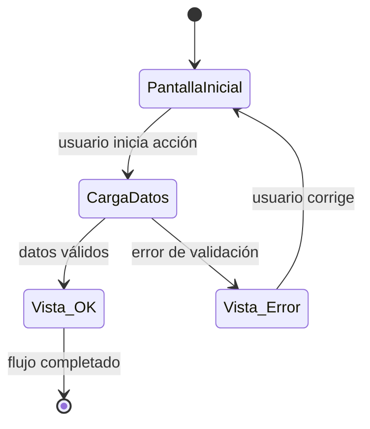

# UX-ID — [Nombre del flujo]

> **Ruta de archivo:** `document/ux-flows/UX-<id>-<slug>.md`
> **Cuándo usar:** US con más de 2 ramas de error, estados o decisiones no explícitas en los criterios de aceptación del PRD.

---

## Metadatos

| Campo | Valor |
|-------|-------|
| ID | UX-ID |
| Fecha | YYYY-MM-DD |
| Estado | Borrador / Validado / Obsoleto |
| PRD Ref | US-XX |
| Ticket Redmine | #ID / N/A |
| Diseño de referencia | [link Figma / Zeplin / N/A] |

---

## Objetivo del flujo

Una frase que describe qué acción completa el usuario y qué valor obtiene al terminar el flujo.

---

## Actores

| Actor | Rol |
|-------|-----|
| Usuario autenticado | … |
| Sistema | … |

---

## Diagrama de estados / pantallas

> Reemplaza el diagrama con los estados reales del flujo. Incluye todos los estados:
> éxito, vacío/sin datos, error de validación, error del sistema, carga en progreso.

---

## Estados cubiertos

| Estado | Descripción | Pantalla / Componente |
|--------|-------------|----------------------|
| Éxito | … | … |
| Vacío | … | … |
| Error de validación | … | … |
| Error del sistema | … | … |
| Carga | … | … |

---

## Reglas de negocio relevantes

Lista solo las reglas que no están en el PRD o que necesitan detalle adicional para ser mapeables a pruebas:

- Regla 1: …
- Regla 2: …

---

## Criterios de completitud del flujo

El flujo está completo cuando:

- [ ] Todos los estados tienen transición definida (sin estados huérfanos).
- [ ] Cada rama de error tiene mensaje de usuario y acción de recuperación.
- [ ] El diagrama es coherente con los AC del PRD (sin contradicción).
- [ ] Diseño de referencia validado o marcado como TBD con fecha límite.

---

## Referencias

- [PRD](../PRD.md)
- [Estándar de flujo SDD](../../ai-specs/specs/flujo-desarrollo-standards.md) Fase 3
